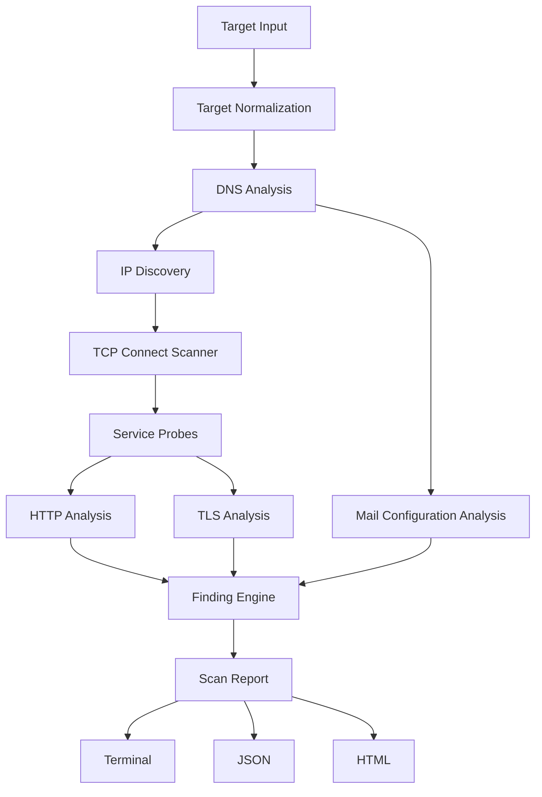

# Surface

Surface is an asynchronous command-line scanner that analyzes externally observable services and security-related configuration for a domain, hostname, HTTP(S) URL, or IP address.

Surface is **not** a complete vulnerability scanner, penetration-testing framework, security certification, or proof that a target is secure.

> [!IMPORTANT]
> Use Surface only on systems you own or are explicitly authorized to assess.

## Example

```text
Surface 0.3.0
Target: example.com
Status: Completed

Hosts
  203.0.113.10
    80/tcp  open  Http
    443/tcp  open  Https
    465/tcp  open  SMTPS
    51820/udp open|filtered Wireguard

Findings
  MEDIUM   HSTS header missing — example.com
  INFO     security.txt not found — example.com
```

Example addresses are documentation-only; tests and CI never scan public infrastructure.

## Features

- IDNA-aware domain, URL, IPv4, and IPv6 normalization
- A, AAAA, CNAME, NS, MX, TXT, and CAA observations
- conservative dangling-CNAME indicators for at most 16 directly observed primary-chain destinations, without destination scanning or takeover claims
- conservative wildcard-DNS detection with exactly two UUID-v4 child probes, hashed answer summaries, and no probe-name retention or downstream scanning
- exact-zone authoritative TCP AXFR checks with bounded counts and no transferred-name retention or scanning
- conservative SPF, DMARC, MTA-STS, and TLS-RPT interpretation
- bounded Tokio TCP connect and UDP response scanning across selectable or complete port ranges
- graceful Ctrl+C cancellation with partial reports
- centralized bounded probes and curated service hints for web, mail, databases, VPNs, infrastructure, and game servers
- bounded HTTP redirects/bodies, selected headers, cookie flags, title and well-known files
- one validating Rustls handshake per deduplicated implicit-TLS endpoint, with negotiated cipher, bounded chain/SAN evidence, leaf SHA-256, and reliably parsed key bits
- evidence-backed findings separated from raw observations
- deterministic terminal, versioned JSON, self-contained escaped HTML, SARIF 2.1.0, and CycloneDX 1.6 reports
- deterministic file/history diffs and versioned exposure scoring
- resolver-returned CNAME-chain reporting with deduplicated scanning of resolved target addresses
- live stage progress on stderr and complete self-contained HTML reports
- default bounded CertSpotter Certificate Transparency discovery, supplied passive subdomain/DKIM observations, optional exact-pair reverse-NS correlation, and offline network/CVE correlation
- detached Ed25519 report signatures and verified SQLite backup/restore

No raw packets, stealth, brute force, exploitation, crawling, directory enumeration, authentication, rate-limit bypass, or unrelated-host discovery is implemented.

## Installation

```bash
git clone https://github.com/bxn-dev/surface.git surface-rs
cd surface-rs
cargo build --release
./target/release/surface version
```

## Usage

```bash
surface scan example.com
surface scan example.com --only dns,http,tls
surface scan https://example.com/path --ports 80,443,8000-8100
surface scan 127.0.0.1 --ports 1-1000 --udp-ports 1-1000 --global-timeout 30s
surface scan 127.0.0.1 --ports all --udp-ports all --concurrency 512 --global-timeout 120m
surface scan example.com --format json --output report.json
surface scan example.com --format html --output report.html
surface scan example.com --format sarif --output report.sarif.json
surface diff old.json new.json --format html --output diff.html
surface diff <OLD_SCAN_ID> <NEW_SCAN_ID> --database ./surface.db
surface scan 127.0.0.1 --persist --database ./surface.db
surface history list --database ./surface.db
surface history show <SCAN_ID> --database ./surface.db
surface history prune --database ./surface.db --older-than 180d --dry-run
surface scan example.com --subdomain www.example.com --dkim-selector selector1 --intelligence-bundle intelligence.json
SURFACE_CERTSPOTTER_API_KEY='…' surface scan example.com # optional higher API allowance
SURFACE_WHOISXML_API_KEY='…' surface scan example.com   # enables reverse-NS correlation
surface report sign report.json --key private-key.hex --signature report.sig.json
surface report verify report.json --signature report.sig.json --public-key public-key.hex
surface database backup --database ./surface.db --output ./surface.backup.db
surface database verify --database ./surface.backup.db
surface completion bash > surface.bash
```

Defaults: `--ports common`, `--udp-ports common`, `--concurrency 64`, `--connect-timeout 1500ms`, `--request-timeout 5s`, `--global-timeout 5m`.

UDP silence is reported as `open|filtered`, never as definitively open. Port-based service names are low-confidence hints until a protocol response confirms them.

A scan runs every applicable built-in check by default. `--only dns,http,tls` restricts work; prerequisites are added automatically. Interactive progress uses an `indicatif` spinner on stderr. Without `--output`, Surface prints the selected format and also writes `surface-<SCAN_ID>.html`; progress is hidden with `--quiet` or when stderr is not a terminal. `RUST_LOG` overrides the default log filter. SQLite persistence is optional: ordinary one-shot scans do not open or require a database.

## Reports

- **terminal** — concise observations, open ports, findings, and counts
- **json** — schema `0.3.0`, complete transport-aware observations/findings/errors/score
- **html** — responsive, print-friendly, self-contained, no remote assets or scripts
- **sarif** — SARIF 2.1.0 findings for code-scanning integrations
- **cyclonedx-json** — CycloneDX 1.6 observed-service inventory and vulnerabilities

See [`docs/report-schema.md`](docs/report-schema.md) and [`docs/scoring.md`](docs/scoring.md).

## Exit codes

| Code | Meaning |
| --- | --- |
| 0 | Report produced without high-severity findings |
| 1 | Invalid CLI usage, target, or configuration |
| 2 | Report produced with high-severity findings |
| 3 | Scan/output failed without a meaningful report |

## Architecture



`surface-core` owns observations and orchestration, `surface-report` owns presentation and signing, `surface-storage` owns local SQLite history and recovery, and `surface-cli` owns process behavior. See [`docs/architecture.md`](docs/architecture.md) and [`docs/database-schema.md`](docs/database-schema.md).

## Limitations

TCP timeouts do not prove filtering. Service identification can be uncertain. TLS evidence comes only from successful validated handshakes to applicable implicit-TLS candidates; certificate inspection is capped at 16 peer certificates, 1 MiB cumulative DER, and 128 normalized SAN entries, and no DER is retained. CDN/reverse-proxy observations may describe edge infrastructure. Header requirements depend on application context. DNSSEC uses Hickory local validation with built-in trust anchors for selected primary-host A/AAAA RRsets. System or upstream resolver limitations can make validation indeterminate; only cryptographic `Proof::Bogus` produces the high-severity DNSSEC finding. Dangling-CNAME checks query selected A/AAAA only for at most 16 resolver-observed primary-chain destinations; only conclusive NXDOMAIN produces a potential indicator, and ownership, claimability, and takeover feasibility are not tested. Destination answers are never scanned or propagated. Wildcard DNS detection compares selected A/AAAA and CNAME answers for exactly two random child names; mixed, rotating, incomplete, or errored answers remain indeterminate, and detection is contextual rather than automatically a vulnerability. Probe names and answers are never retained or scanned. AXFR runs only when primary-host SOA evidence and exact-owner NS records establish one zone; it retains bounded counts, never transferred owner names or records. DKIM is not inferred without selectors. No active exploitation or complete vulnerability coverage is provided. A clean report does not prove security.

See [`docs/limitations.md`](docs/limitations.md).

## Development

```bash
cargo fmt --all --check
cargo clippy --workspace --all-targets --all-features -- -D warnings
cargo test --workspace --all-features
cargo doc --workspace --no-deps
cargo deny check
cargo build --release
```

Tests bind only local fixture servers and do not require public internet access. See [`CONTRIBUTING.md`](CONTRIBUTING.md).

## Roadmap

Phases 0–12 are complete. Future work remains additive and will not introduce offensive scanning features.

## License

MIT — see [`LICENSE`](LICENSE).
