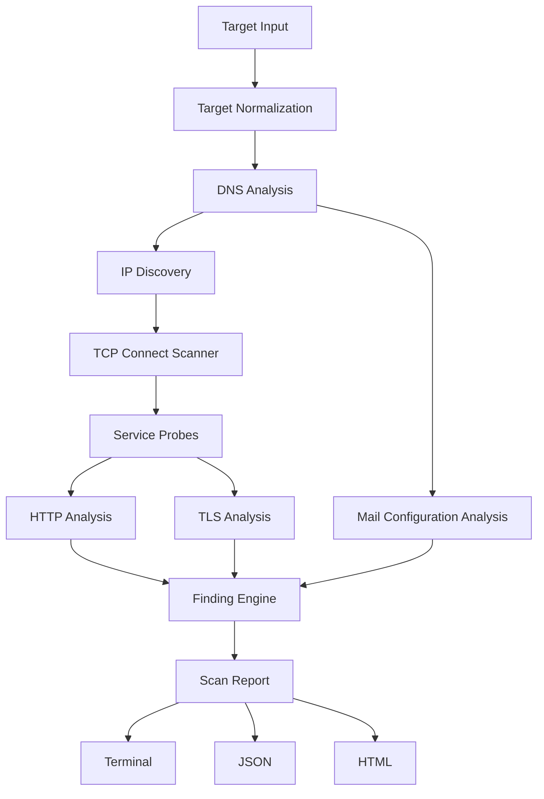

# Surface

Surface is an asynchronous command-line scanner that analyzes externally observable services and security-related configuration for a domain, hostname, HTTP(S) URL, or IP address.

Surface is **not** a complete vulnerability scanner, penetration-testing framework, security certification, or proof that a target is secure.

> [!IMPORTANT]
> Use Surface only on systems you own or are explicitly authorized to assess. Active scans require `--acknowledge-authorization` unless the target is localhost or loopback.

## Example

```text
Surface 0.1.0
Target: example.com
Status: Completed

Hosts
  203.0.113.10
    80/tcp  open  Http
    443/tcp open  Https

Findings
  MEDIUM   HSTS header missing — example.com
  INFO     security.txt not found — example.com
```

Example addresses are documentation-only; tests and CI never scan public infrastructure.

## Features

- IDNA-aware domain, URL, IPv4, and IPv6 normalization
- A, AAAA, CNAME, NS, MX, TXT, and CAA observations
- conservative SPF, DMARC, MTA-STS, and TLS-RPT interpretation
- bounded Tokio TCP connect scanning with per-operation/global timeouts
- graceful Ctrl+C cancellation with partial reports
- safe HTTP, HTTPS, SSH, SMTP, and capped banner identification
- bounded HTTP redirects/bodies, selected headers, cookie flags, title and well-known files
- validating Rustls TLS handshakes and certificate metadata
- evidence-backed findings separated from raw observations
- deterministic terminal, versioned JSON, and self-contained escaped HTML reports

No raw packets, stealth, brute force, exploitation, crawling, directory enumeration, authentication, rate-limit bypass, or unrelated-host discovery is implemented.

## Installation

```bash
git clone https://github.com/bxn-dev/surface.git surface-rs
cd surface-rs
cargo build --release
./target/release/surface version
```

## Usage

```bash
surface scan example.com --acknowledge-authorization
surface scan https://example.com/path --ports 80,443,8000-8100 --acknowledge-authorization
surface scan 127.0.0.1 --ports 1-1000 --global-timeout 30s
surface scan example.com --format json --output report.json --acknowledge-authorization
surface scan example.com --format html --output report.html --acknowledge-authorization
surface scan 127.0.0.1 --persist --database ./surface.db
surface history list --database ./surface.db
surface history show <SCAN_ID> --database ./surface.db
surface history prune --database ./surface.db --older-than 180d --dry-run
surface completion bash > surface.bash
```

Defaults: `--ports common`, `--concurrency 64`, `--connect-timeout 1500ms`, `--request-timeout 5s`, `--global-timeout 5m`.

Logs use stderr; report data uses stdout or `--output`. `RUST_LOG` overrides the default log filter. SQLite persistence is optional: ordinary one-shot scans do not open or require a database.

## Reports

- **terminal** — concise observations, open ports, findings, and counts
- **json** — schema `0.1.0`, complete structured observations/findings/errors
- **html** — responsive, print-friendly, self-contained, no remote assets or scripts

See [`docs/report-schema.md`](docs/report-schema.md).

## Exit codes

| Code | Meaning |
| --- | --- |
| 0 | Report produced without high-severity findings |
| 1 | Invalid CLI usage, target, or configuration |
| 2 | Report produced with high-severity findings |
| 3 | Scan/output failed without a meaningful report |
| 4 | Authorization acknowledgement missing |

## Architecture



`surface-core` owns observations/orchestration, `surface-report` owns presentation, `surface-storage` owns optional SQLite history, and `surface-cli` owns process behavior. See [`docs/architecture.md`](docs/architecture.md) and [`docs/database-schema.md`](docs/database-schema.md).

## Limitations

TCP timeouts do not prove filtering. Service identification can be uncertain. CDN/reverse-proxy observations may describe edge infrastructure. Header requirements depend on application context. DNSSEC is not cryptographically validated. DKIM is not inferred without selectors. No active exploitation or complete vulnerability coverage is provided. A clean report does not prove security.

See [`docs/limitations.md`](docs/limitations.md).

## Development

```bash
cargo fmt --all --check
cargo clippy --workspace --all-targets --all-features -- -D warnings
cargo test --workspace --all-features
cargo doc --workspace --no-deps
cargo deny check
cargo build --release
```

Tests bind only local fixture servers and do not require public internet access. See [`CONTRIBUTING.md`](CONTRIBUTING.md).

## Roadmap

After a stable CLI release: local SQLite history/report comparison, certificate/port change detection, additional safe probes, SARIF, then an SSRF-hardened optional hosted interface. No offensive features are planned.

## License

MIT — see [`LICENSE`](LICENSE).
