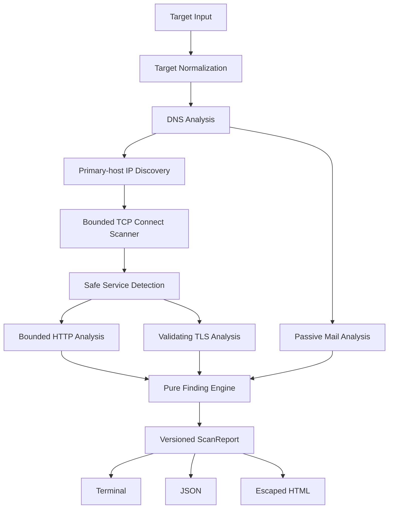

# Architecture

## Crates

- `surface-core` — typed target/configuration, observations, bounded Tokio orchestration, errors, and deterministic findings. It has no terminal rendering.
- `surface-report` — pure terminal/JSON/HTML rendering. HTML escapes all target-controlled data and loads no remote resources.
- `surface-cli` — Clap arguments, authorization policy, tracing setup, Ctrl+C cancellation, files/stdout, and exit codes.

Dependencies flow `surface-core → surface-report → surface-cli`; no cycle exists.

## Boundaries

Only explicit IPs and primary-host A/AAAA addresses become active scan targets. MX, NS, CNAME, TXT, redirects to other hosts, and page links never expand scan scope. TCP uses ordinary `connect`; every active stage has a timeout and bounded concurrency. Completed observations survive recoverable stage errors and cancellation.
