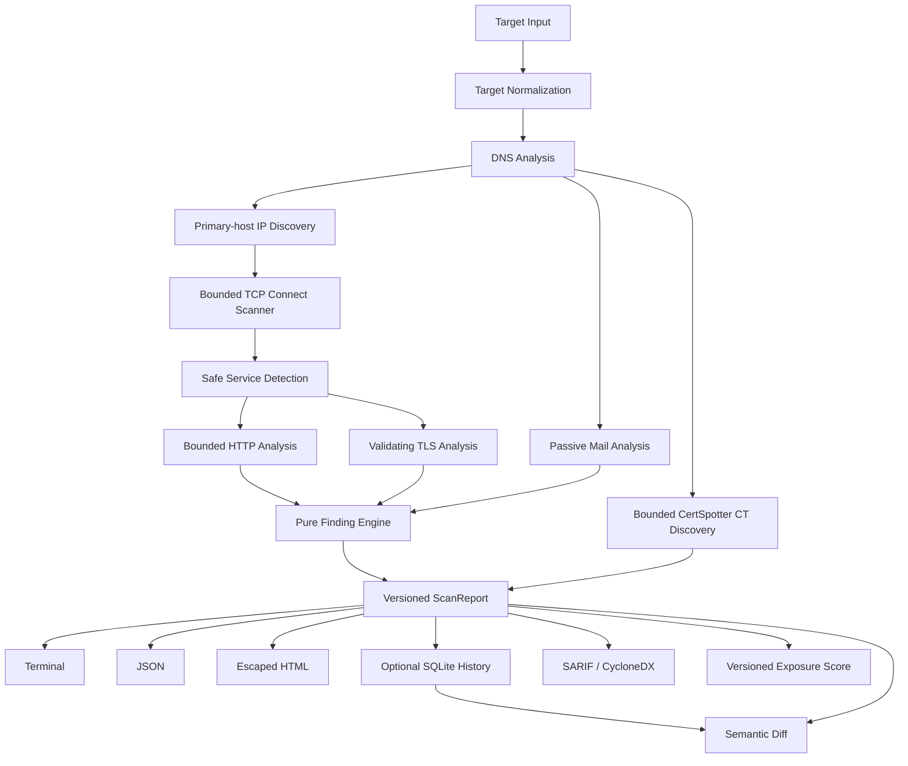

# Architecture

## Crates

- `surface-core` — typed target/configuration, observations, bounded Tokio orchestration, errors, and deterministic findings. It has no terminal rendering.
- `surface-report` — pure terminal/JSON/HTML, SARIF/CycloneDX, and semantic-diff rendering. HTML escapes all target-controlled data and loads no remote resources.
- `surface-cli` — Clap arguments, progress, tracing setup, Ctrl+C cancellation, files/stdout, persistence, intelligence, signing, recovery, and exit codes.
- `surface-storage` — versioned SQLite migrations, immutable local history, audit, retention, and verified recovery.

`surface-core` remains independent. `surface-report` and `surface-storage` consume its report model; `surface-cli` orchestrates both. No dependency cycle exists.

## Boundaries

Only explicit IPs and resolver-returned A/AAAA addresses for the primary target become active scan targets. Resolver-returned CNAME edges are reported and their already-resolved addresses are deduplicated; MX, NS, TXT, redirects to other hosts, and page links never expand scan scope. TCP uses ordinary `connect`; every active stage has a timeout and bounded concurrency. Completed observations survive recoverable stage errors and cancellation.

Persistence is opt-in. A one-shot scan opens no database unless `--persist --database PATH` is supplied. Report serialization and normalized finding writes share one transaction. Historical report JSON cannot be updated; deletion cascades dependent metadata and records an audit event in the same transaction.

Service probes are selected by a centralized port-to-behavior registry. Payloads are fixed, read-only discovery commands; banner bytes, endpoint count, time, and concurrency remain bounded. Diffing and scoring are pure functions over completed report data and perform no network I/O.

HTTP remains address-pinned and same-origin. CertSpotter Certificate Transparency names, supplied subdomains, and DKIM selectors are passive and bounded; CT names are reported but never scanned automatically. CVE/network metadata comes only from a validated offline bundle; candidates are correlations, never exploit confirmation.
